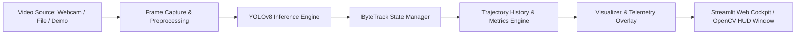

# Real-Time Object Detection and Tracking

An autonomous, hardware-accelerated computer vision application for real-time multi-object detection and trajectory tracking using YOLOv8 and ByteTrack. Designed for high throughput and visual telemetry clarity.

## Project Highlights
- **Pretrained Detection Backbone:** YOLOv8 deep learning network supporting real-time inference on CPU, Apple Silicon (MPS), and NVIDIA CUDA.
- **Persistent Multi-Object Tracking:** ByteTrack integration providing unique IDs, tracking trajectories, and velocity vectors across occlusions.
- **Multiple Video Sources:** Live webcam feed, pre-recorded video files (MP4, AVI, MOV), or built-in synthetic traffic simulation.
- **Telemetry UI & CLI:** Built-in Streamlit web telemetry cockpit and standalone OpenCV CLI runner.
- **Anti-Slop Design System:** Built adhering to custom design guidelines documented in `DESIGN.md`.

## CodeAlpha Task 4 Compliance
- **Video Input:** Real-time video input via live webcam (`0`), video files, or bundled benchmark feed via OpenCV.
- **Pretrained Detection:** YOLOv8 deep learning network (Nano/Small) with MPS, CUDA, and CPU hardware acceleration.
- **Frame Processing & Bounding Boxes:** Real-time frame processing with calibrated bounding boxes and pill badges.
- **Tracking Algorithms:** Support for both **Deep SORT (BoT-SORT)**, **ByteTrack**, and classic **SORT** (IOU Hungarian association).
- **Real-time Telemetry:** Output with class labels, persistent tracking IDs, trajectory trail lines, and live FPS telemetry.

---

## Architecture Flow



---

## Project Structure

```
CodeAlpha_Object_Detection_and_Tracking/
├── src/
│   ├── __init__.py
│   ├── detector.py       # YOLOv8 inference wrapper with hardware acceleration
│   ├── tracker.py        # Trajectory tracker, state coordinator, velocity logic
│   ├── visualizer.py     # Custom OpenCV telemetry visualizer and HUD renderer
│   └── utils.py          # FPS calculator, video writers, synthetic video generator
├── app.py                # Streamlit web telemetry application
├── main.py               # Standalone OpenCV CLI runner
├── DESIGN.md             # Design system token specifications
├── requirements.txt      # Project dependencies
└── README.md             # Documentation
```

---

## Getting Started

### 1. Prerequisites
- Python 3.10+ (Python 3.11 or 3.12 recommended)
- Git

### 2. Clone and Setup Environment

```bash
git clone https://github.com/potlasrisharan/CodeAlpha_Object_Detection_and_Tracking.git
cd CodeAlpha_Object_Detection_and_Tracking

python3 -m venv .venv
source .venv/bin/activate  # On Windows: .venv\Scripts\activate

pip install -r requirements.txt
```

---

## Usage

### Option A: Run Interactive Web Telemetry Dashboard
Launch the web interface in your browser:
```bash
streamlit run app.py
```
From the sidebar, select your input source (Synthetic Traffic Demo, Live Camera, or Video Upload), tune confidence thresholds, and toggle trajectory trails.

### Option B: Run Standalone CLI with OpenCV Window
Run on built-in synthetic traffic simulation:
```bash
python main.py --source demo
```

Run on live webcam:
```bash
python main.py --source 0
```

Run on a video file and save output:
```bash
python main.py --source path/to/video.mp4 --save-output processed_output.mp4
```

Filter specific classes (e.g., only detect persons and cars):
```bash
python main.py --source demo --classes person car
```

---

## Submission & LinkedIn Demonstration Notes
To record your video explanation for CodeAlpha internship submission:
1. Run `streamlit run app.py` or `python main.py --source demo`.
2. Demonstrate real-time tracking IDs persisting across frames as objects traverse the frame.
3. Highlight the live inference FPS and the active telemetry statistics.
4. Share the video on LinkedIn tagging `@CodeAlpha` with this GitHub repository URL.
